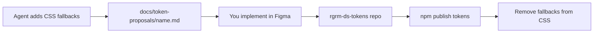

# Token proposals

Design tokens live in a separate package (`@rgrmdesign/rgrm-ds-tokens`), generated from Figma variables. When a component needs tokens that do not yet exist, agents document proposals here before Figma implementation.

## Workflow



1. **Agent** uses `var(--rgrm-<component>-<property>, <fallback>)` in CSS
2. **Agent** creates `docs/token-proposals/<component>.md` with proposed tokens
3. **You** implement variables in the [Figma library](https://www.figma.com/community/file/1645762099681840809)
4. **You** update the `rgrm-ds-tokens` repository and publish to npm
5. **You** bump the peer dependency if needed and remove CSS fallbacks once tokens ship

## Proposal file format

Create `<component>.md` with:

```markdown
# <Component> — token proposals

**Status:** proposed | in-figma | published

| Token                            | Fallback | Theme | Usage             |
| -------------------------------- | -------- | ----- | ----------------- |
| `--rgrm-list-item-padding-block` | `0.5rem` | all   | List item spacing |
```

## Rules

- Never use raw hex/rgb/px as final styling — always `var(--rgrm-*, fallback)`
- Prefer semantic tokens over primitive swatches
- Note token proposals in the PR summary: "Token proposals — implement in Figma"
